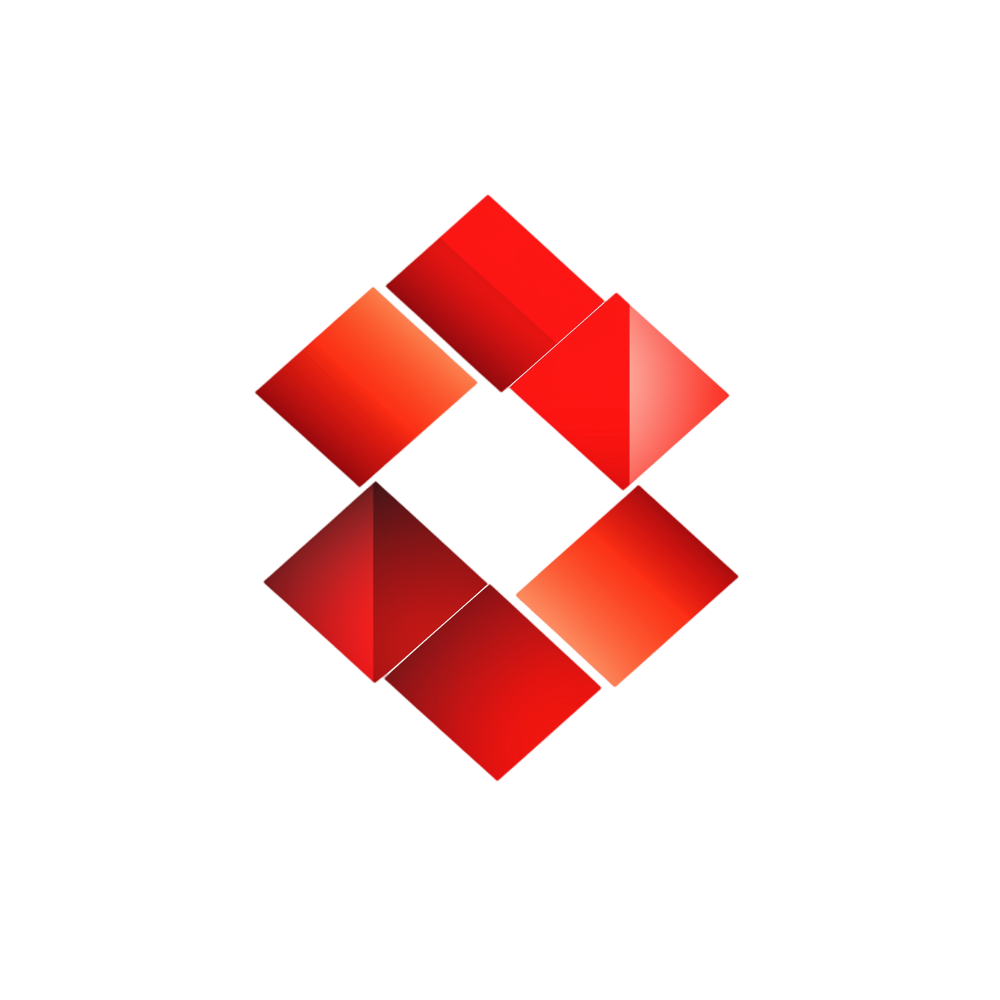

#  Lockerly

Lockerly is a powerful and intuitive web application designed to securely store and manage your files. Whether you're collaborating with a team or managing personal files, Lockerly simplifies the process of storing, sharing, and organizing your data. With features like file uploads, version control, and access control, Lockerly ensures that your files are safe, accessible, and organized, wherever you are.

---

## 🚀 Features

- **Secure File Storage**: Safely upload, store, and download your files with complete peace of mind.
- **Version Control**: Keep track of file revisions and revert to previous versions as needed.
- **Collaboration Tools**: Share files with others and collaborate seamlessly.
- **Access Control**: Manage permissions and control who can access, edit, or share your files.
- **Real-time Analytics**: Track file usage and collaboration stats using dynamic charts.

---

## 🛠️ Tech Stack

Lockerly is built with modern web technologies to ensure high performance, security, and scalability.

<div align="center">
<a href="https://nextjs.org" target="_blank"></a>
<a href="https://tailwindcss.com" target="_blank"></a>
<a href="https://www.typescriptlang.org" target="_blank"></a>
<a href="https://appwrite.io" target="_blank"></a>
<a href="https://ui.shadcn.com/" target="_blank"></a>
</div>

- **Next.js 15**: The latest version of Next.js provides a robust framework for server-side rendering, optimized performance, and efficient routing.
- **Appwrite**: A self-hosted backend server that offers a comprehensive suite of APIs for authentication, file management, and database operations.
- **Shadcn**: A design system for building elegant and accessible components, ensuring a sleek and intuitive UI.
- **Chart.js**: A powerful charting library used to visualize file usage statistics and analytics in real-time.

---

## 💻 Getting Started

### Prerequisites

Make sure you have **Node.js** and **Yarn** installed on your system.

```bash
# Clone the repository
git clone https://github.com/your-username/lockerly.git

# Navigate to the project directory
cd lockerly

# Install dependencies
yarn install or npm i

# Run the application
yarn dev or npm run dev
```

Lockerly will be available at http://localhost:3000.
